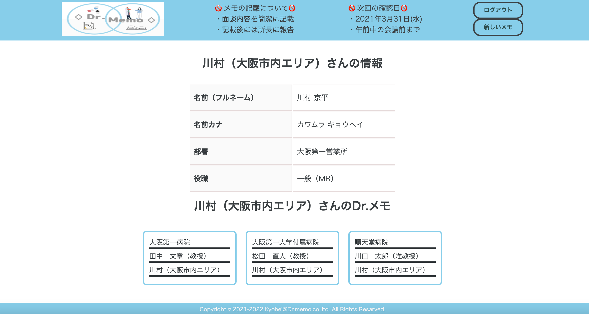
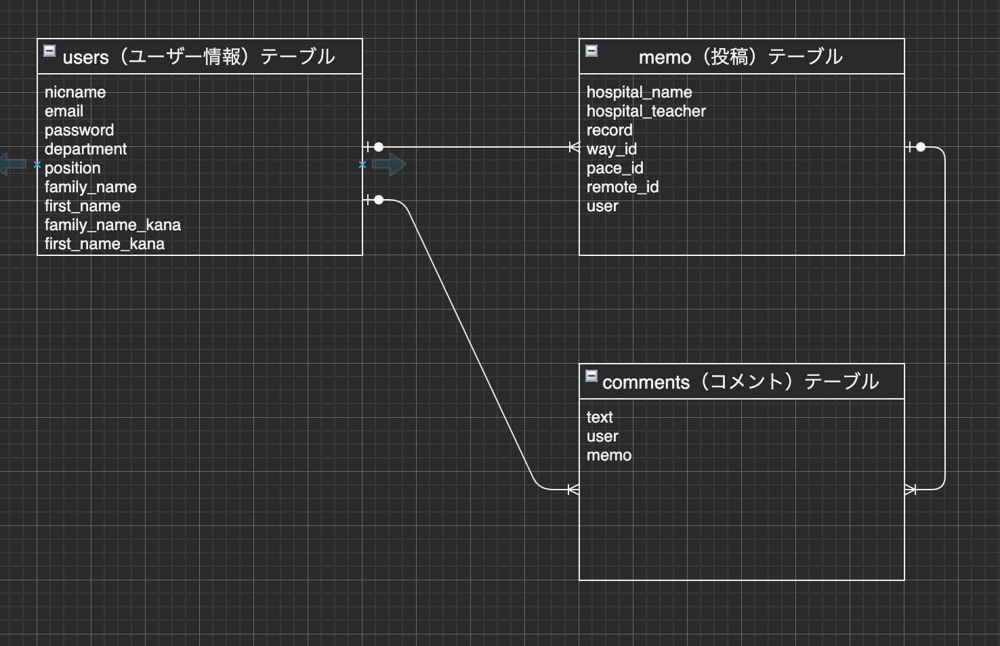

# アプリ名
Dr.Memo

# 概要
医療業界向けのサラリーマン向けに得意先に行った際の簡易メモ  
得意先行った際に情報を都度簡単に更新し見やすいツールを作成

# 本番環境
https://original-34579.herokuapp.com/  

Basic認証  
ユーザー名:34579  
パスワード:sb851097   
  
ログイン情報（テスト用）  
Eメール：kawamura@com  
パスワード：sb851097  
  
  
# 制作背景(意図)  
得意先向けに訪問ノート等を過去に手書きで付けていたが管理が難しくi-Padが会社で  
導入された頃はメモ機能でノートを付けていたが得意先の編集などメンバーにシェアが  
出来ない等など難点がありました。継続して、チームメンバーがノートを書いて全員で  
シェア出来るように簡易で管理しやすいメモアプリを作成しました。  
 
# DEMO

### トップページ

  
・シンプルにトップページを作成しようとスカイブルー色をメインに作成（左上のロゴも自身で作成）  
・ヘッダーも固定させて記載期限を設けて、🚫マークを用いて分かりやすく記載  
・個人情報の観点からログインしていないと詳細表示されないように設定    
・右上にてログイン・新規登録を実施（ログイン後は、ログアウト・新しいメモに切替）
  
### ユーザー新規登録画面

・新規登録にてニックネーム、メールアドレス、パスワード、本名（フルネーム）、本名カナ（全角）、部署、所属を入力で登録可能  
・全ての項目が入力されていないと登録出来ないように設定  
・パスワードは８文字以上で英数字混合で登録が可能  
・管理しやすいようにplaceholderにて記載を指定  
  
### 新規投稿画面

   
・新規投稿にて病院の名前と先生、活動方法、活動頻度、リモート面談の可否、活動記録の入力で登録可能  
・全ての項目が入力されていないと登録出来ないように設定  
・活動記録はスクロール機能を入れており、多くのメモが記載可能  
・メモの編集の時も同じ画面にて入力が反映された状態で編集が可能  
  

### 投稿一覧表示

  
・ログイン後にはDr.情報一覧として得意先情報（病院名・面談した先生）と  記載したユーザー名を表示  
・病院名とユーザー名はクリックすると詳細ページアクセスし、編集・削除などの出来るように設定済  
  
### 投稿詳細表示（編集・削除）

  
・投稿者のみ編集と削除の機能を設定
・活動記録はスクロールで見やすく、改行も反映されるように設定  
・コメント機能で他のユーザーがコメント出来るように設定  
・メモの編集の時も同じ画面にて入力反映された状態で編集が可能（新規投稿画面）  
  
 
### ユーザー詳細表示
  
  
・投稿一覧のユーザー名クリックするとユーザー詳細ページアクセス出来るように設定済  
・ユーザーの情報（名前、カナ、役職、部署）が表示  
・投稿したメモ一覧を表示  
  
# 工夫したポイント
・シンプルで入力しやすいフォームの作成  
・ヘッダーを固定して重要事項などを分かりやすく表記  
・活動記録を改行を反映し、更にスクロールして見れるように機能を追加  
・編集する時も入力が反映された状態で編集が可能  
・全員でメモをシェア出来るようにコメント機能を使いコミュニケーションを取れるように実装  

# 使用技術（開発環境）
## バックエンド
Ruby・Ruby on Rails
## フロントエンド
HTML・CSS
## インフラ
AWS（EC2）
## Webサーバ（本番環境）
heroku・nginx
## アプリケーションサーバ（本番環境）
unicorn
## ソース管理
GitHub・GitHubDesktop
## テスト
RSpec
## エディタ
VSCode

# 課題や今後実装したい機能
・一覧表示をもう少し綺麗見せたい（ログイン後のトップページ）  
・ユーザー管理機能の編集機能の追加  
・エラーメッセージの対応（日本語も含め）  
・病院名など検索出来るようキーワード検索を導入  

# Dr.MemoのER図
  

# DB設計

## usersテーブル

| Column           | Type   | Options                   |
| -----------------|--------|---------------------------|
| nickname         | string | null: false               |
| email            | string | null: false, unique: true |
| password         | string | null: false               |
| department       | string | null: false               |
| position         | string | null: false               |
| family_name      | string | null: false               |
| first_name       | string | null: false               |
| family_name_kana | string | null: false               |
| first_name_kana  | string | null: false               |

### Association

- has_many :memos
- has_many :comments

## memosテーブル

| Column           | Type       | Options           |
| -----------------|------------|-------------------|
| hospital_name    | string     | null: false       |
| hospital_teacher | string     | null: false       |
| record           | text       | null: false       |
| way_id           | integer    | null: false       |
| pace_id          | integer    | null: false       |
| remote_id        | integer    | null: false       |
| user             | references | foreign_key: true |

### Association

- belongs_to :user
- has_many :comments

## comments table

| Column | Type       | Options           |
|--------|------------|-------------------|
| text   | text       | null: false       |
| memo   | references | foreign_key: true |
| user   | references | foreign_key: true |

### Association

- belongs_to :memo
- belongs_to :user
