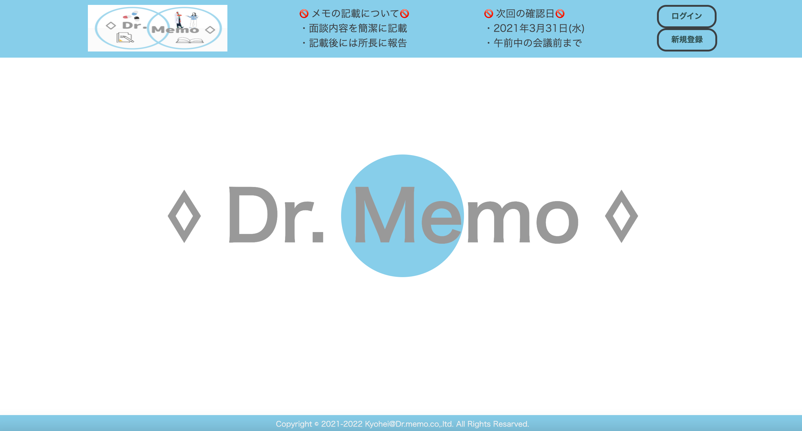
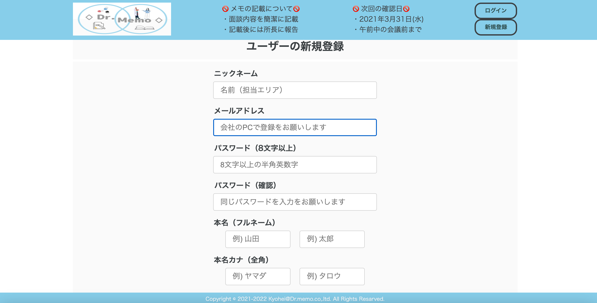
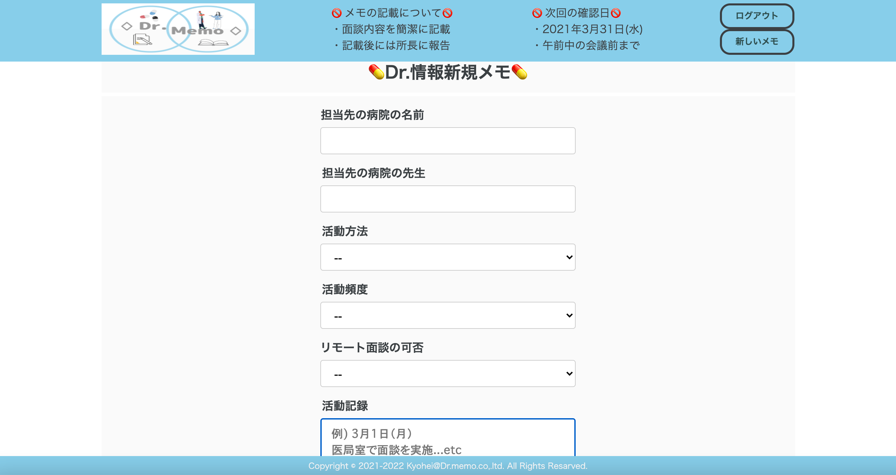

# アプリ名
💊Dr.Memo💊

# 概要
医療業界向けのサラリーマン向けに得意先に行った際の簡易メモ  
得意先行った際に情報を都度簡単に更新し見やすいツールを作成

# 本番環境
https://original-34579.herokuapp.com/  
  
ログイン情報（テスト用）  
Eメール：kawamura@com  
パスワード：sb851097  
  
# 制作背景(意図)  
得意先向けに訪問ノート等を過去に手書きで付けていたが管理が難しくi-Padが    
会社とかで導入された頃はメモ機能でノートを付けていたが得意先の編集など    
メンバーにシェアが出来ないなど難点がありました。継続して、チームメンバーが    
ノートを書いて全員でシェア出来るように簡易で管理しやすいメモアプリを作成。  
 
# DEMO

### トップページ

  
・シンプルにトップページを作成しようとスカイブルー色をメインに作成（左上のロゴも自身で作成）  
・ヘッダーも固定させて記載期限を設けて、🚫マークを用いて分かりやすく記載  
・個人情報の観点からログインしていないと詳細表示されないように設定    
・右上にてログイン・新規登録を実施（ログイン後は、ログアウト・新しいメモに切替）
  
### ユーザー新規登録画面

  
・新規登録にてニックネーム、メールアドレス、パスワード、本名（フルネーム）、本名カナ（全角）、部署、所属を入力で登録可能  
・全ての項目が入力されていないと登録出来ないように設定  
・パスワードは８文字以上で英数字混合で登録が可能  
・管理しやすいようにplaceholderにて記載を指定  
  
### 新規投稿画面

  
・新規投稿にて病院の名前と先生、活動方法、活動頻度、リモート面談の可否、活動記録の入力で登録可能  
・全ての項目が入力されていないと登録出来ないように設定  
・活動記録はスクロール機能を入れており、多くのメモが記載可能  
・メモの編集の時も同じ画面にて入力反映された状態で編集が可能  
  

### 投稿一覧表示

  
ログイン後にはDr.情報一覧として得意先情報（病院名・面談した先生）と  
記載したユーザー名を表示させるようにしております。病院名とユーザー名は  
クリックすると詳細ページアクセスし、編集・削除などの出来るように設定済

# テーブル設計

## usersテーブル

| Column           | Type   | Options                   |
| -----------------|--------|---------------------------|
| nickname         | string | null: false               |
| email            | string | null: false, unique: true |
| password         | string | null: false               |
| department       | string | null: false               |
| position         | string | null: false               |
| family_name      | string | null: false               |
| first_name       | string | null: false               |
| family_name_kana | string | null: false               |
| first_name_kana  | string | null: false               |

### Association

- has_many :memos
- has_many :comments

## memosテーブル

| Column           | Type       | Options           |
| -----------------|------------|-------------------|
| hospital_name    | string     | null: false       |
| hospital_teacher | string     | null: false       |
| record           | text       | null: false       |
| way_id           | integer    | null: false       |
| pace_id          | integer    | null: false       |
| remote_id        | integer    | null: false       |
| user             | references | foreign_key: true |

### Association

- belongs_to :user
- has_many :comments

## comments table

| Column | Type       | Options           |
|--------|------------|-------------------|
| text   | text       | null: false       |
| memo   | references | foreign_key: true |
| user   | references | foreign_key: true |

### Association

- belongs_to :memo
- belongs_to :user
